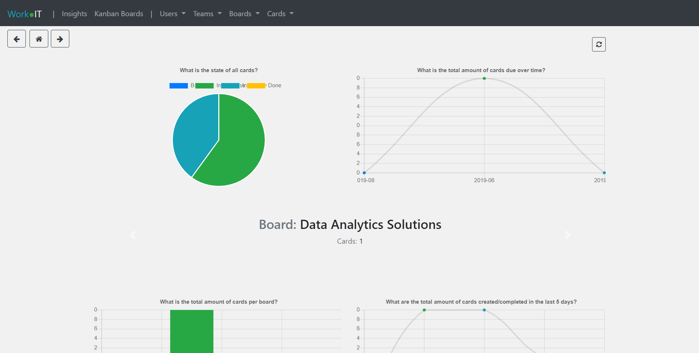
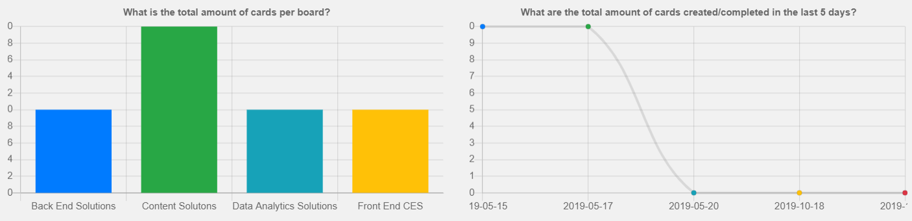
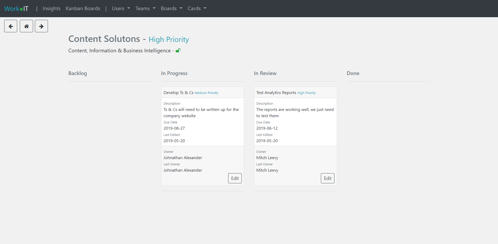
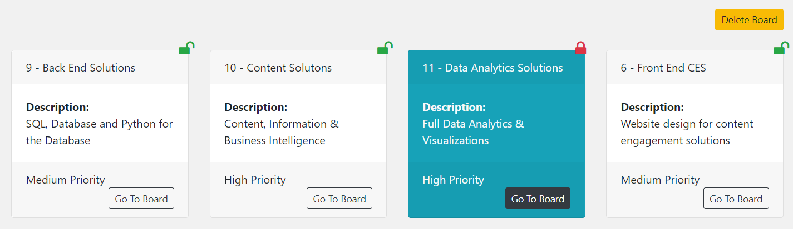

# WorkITApp

WorkIt is a simple ticketing and workflow analysis system. With the use of Kanban and D3js visualizations on the ticketing databases.

> Kanban is a scheduling system for lean manufacturing and just-in-time manufacturing. 
> Taiichi Ohno, an industrial engineer at Toyota, developed kanban to improve manufacturing efficiency.  

WorkIt makes use of dynamically generated D3js visualizations in conjunction with a Flask application and Jinja2 Templating.
The small setup incorporates a local database, though the intention of this tool is to provide a bussiness
wide solution to analysing workflow and productivity through simplistic ticket analysis. 

You will find many solutions that are similar to applications like Trello. Though the application is
still in production, the intention is to have a workflow ticketing solution and reporting dashboard that is fully customizable.

The WorkIt application also allows for multiple teams in one service with cross bossiness analysis. And 
with the intention of producing more granular visualizations per team, project and user.

Accessibility across the application can be locked down to a granular level. The production phase aims to implement a fully
granulated sense of control in the application. This will allow the application to be versatile at any business level,
whilst maintaining a consolidated analytical platform.  